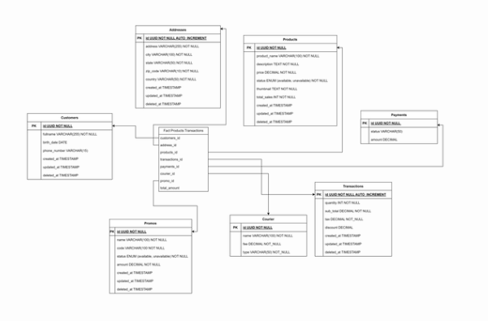

# Data Engineer 
<!-- Daftar Isi -->
## Daftar Isi
- [Data Engineer](#data-engineer)
  - [Daftar Isi](#daftar-isi)
  - [About Project](#about-project)
  - [Tech Stacks](#tech-stacks)
    - [Bahasa Pemrograman](#bahasa-pemrograman)
    - [Library](#library)
    - [Database](#database)
    - [Tools dan Platform](#tools-dan-platform)
  - [Features](#3features)

## About Project
Proyek ini bertujuan untuk mempersiapkan data agar dapat digunakan dalam model prediksi biaya total proyek Bank Dunia dengan menerapkan proses ETL (Extract, Transform, Load). Data diekstraksi dari berbagai sumber seperti file CSV, JSON, XML, database SQLite, dan API World Bank. Selanjutnya, data tersebut digabungkan dan dibersihkan melalui beberapa langkah seperti penyesuaian tipe data, penanganan missing values, penghapusan duplikasi, dan penghapusan outliers. Transformasi data juga mencakup pembuatan variabel dummy, rekayasa fitur, serta penskalaan fitur. Data yang telah ditransformasi kemudian dimuat ke dalam database atau Google Cloud Storage. Proyek ini juga mencakup visualisasi dan analisis data menggunakan teknik visualisasi seperti Plotly, Matplotlib, dan Seaborn untuk menghasilkan analisis yang informatif dan menarik, termasuk analisis statistik deskriptif, korelasi, distribusi, tren, dan perbandingan.

## Tech Stacks
### Bahasa Pemrograman
- Python: Digunakan sebagai bahasa pemrograman utama untuk seluruh proses ETL dan analisis data.

### Library
- pandas
- psycopg2
- os
- dotenv 
- firebase_admin
- datetime 
- google.cloud
- logging

### Database
- PostgreSQL

### Tools dan Platform
- Jupyter Notebook
- Firebase
- Google BigQuery
- Looker Studio

## Features
- Ekstraksi Data (Extract)
- Transformasi Data (Transformation)
- Memuat Data (Load)
- Membuat Dasboard untuk memvisualisasikan data 

Dasboard Transaksi

Dashboard Product

